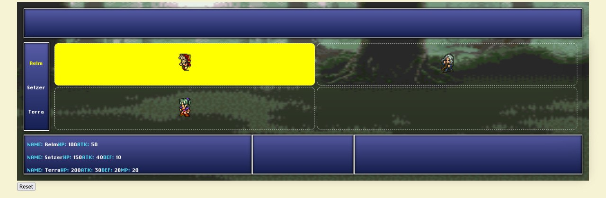

# Proyecto Semestral: Final Reality Tactics

## Avance hasta EF1

El modelo está en `src/main/scala/model`, bajo el paquete `cl.uchile.dcc.model`.
Cada clase o trait tiene su propio archivo. Se usa herencia básica para compartir
atributos, `Option` para valores opcionales y colecciones nativas de Scala.

- `units`: caballero, arquero, ladrón, ambos magos y enemigo; vida, maná,
  inventario y slot de arma. `Player` reconoce la derrota cuando todas sus
  unidades tienen vida cero (también si su lista está vacía).
- `items`: cinco armas y cuatro pociones. Un arma puede no tener dueño todavía.
- `actions`: las ocho acciones de EP2, con listas tipadas de armas o pociones y
  una jerarquía sencilla para magia blanca y negra.
- `map`: paneles con coordenadas, unidades y vecinos ortogonales explícitos.
- `combat`: `TurnScheduler`, que registra barras, calcula máximos, aumenta todas
  las barras, determina las unidades listas y señala a quién corresponde actuar.

### Decisiones del modelo

Los atributos fijos son `val`; el estado mutable se guarda en campos privados.
Las listas públicas son inmutables. Unidades e ítems conservan identidad propia:
dos unidades con los mismos atributos siguen siendo dos participantes distintos.

El slot de arma y el dueño se pueden configurar por separado como datos de EP1.
Las restricciones para equipar, los efectos de pociones, la ejecución de acciones,
fuentes, objetivos y el flujo del controlador corresponden a entregas posteriores.

Los paneles reconocen como vecinos las cuatro direcciones ortogonales (no las
diagonales), siguiendo el ejemplo de esquina del enunciado. `addNeighbor` registra
la relación en el panel receptor; para un mapa bidireccional se registra en ambos.

El máximo de barra es `peso + pesoArma / 2.0` para personajes y `peso` para enemigos.
Sin arma se considera peso de arma cero. Se calcula usando el slot actual, por lo
que refleja un cambio de arma. El progreso usa `Double` para conservar fracciones.
El excedente no se recorta: define la prioridad de quienes completaron su barra.
En empates se usa el orden de ingreso. `nextUnit` consulta sin modificar el estado;
al terminar la acción, `resetBar` deja la barra de esa unidad en cero.

Añadir una unidad repetida no borra su progreso. Quitar o reiniciar una unidad
ausente no tiene efecto. Consultar su barra devuelve `None`. Los incrementos deben
ser finitos y no negativos. Estas decisiones también tienen pruebas.

### Ejecutar las pruebas

Desde la carpeta `Mememon-2026-2`, ejecutar:

```bash
sbt test
```

Las pruebas MUnit están en `src/test/scala/model` y cubren EP1, EP2 y EF1,
incluyendo casos vacíos, empates, máximos fraccionarios, reinicios y eliminación.
Se conservan las versiones y dependencias originales de la plantilla.

## Descripción del Proyecto

Este repositorio contiene la plantilla base para el proyecto semestral del curso. El objetivo principal es desarrollar una versión simplificada de un juego de combate táctico, enfocado exclusivamente en la implementación de la lógica de negocio mediante el patrón arquitectónico **Modelo-Vista-Controlador (MVC)**. 

En particular, a lo largo del semestre trabajarán en la construcción del **Modelo** (las entidades del juego como personajes, armas, paneles y sus interacciones mediante acciones) y el **Controlador** (el motor lógico encargado de gestionar los turnos, flujo del juego y reglas, como `GameController`). No se implementará una Vista gráfica (frontend), por lo que todo se basará en código Scala puro.

## Referencia Visual

Aunque el proyecto se evaluará mediante pruebas unitarias y lógica de consola sin necesidad de conectarlo a una interfaz web, aquí tienen una imagen del "front-end" conceptual del juego. Esto les servirá para hacerse una idea de cómo deberían verse estructurados lógicamente el mapa (en base a paneles) y sus unidades a lo largo de las entregas:



## Enunciado del Proyecto

Las reglas completas del juego, las entidades requeridas y el detalle de cada entrega parcial y final pueden encontrarse en el enunciado oficial del proyecto.

[Link de ucursos del enunciado](https://www.u-cursos.cl/ingenieria/2026/2/CC3002/1/material_docente/detalle?id=10946097)

## ¿Qué se estará evaluando?

El trabajo a lo largo del semestre será evaluado principalmente en base a los siguientes tres pilares:

1. **Diseño (50%)**: Se evaluará la calidad de su código, exigiendo que este cumpla con los principios de diseño orientado a objetos enseñados en el curso. Se espera un código extensible y con responsabilidades bien definidas.
2. **Testing y Coverage (35%)**: Se evaluará que su código tenga pruebas automatizadas utilizando **MUnit** con una cobertura de al menos el 90% para obtener el puntaje completo. Las pruebas deben comprobar tanto los casos de uso esperados como los casos de borde (ej. fallos en restricciones de acciones).
3. **Documentación (15%)**: Cada clase, interfaz (trait) y método público debe estar debidamente documentado usando el formato Scaladoc.

## Cómo empezar

1. Lean detenidamente el enunciado principal del proyecto.
2. Exploren este código base. Encontrarán una clase inicial `GameController` en el paquete `controller` desde la cual podrán comenzar a articular su lógica.
3. Asegúrense de usar herramientas de control de versiones (Git) de manera constante, documentando adecuadamente sus avances mediante *commits*.
